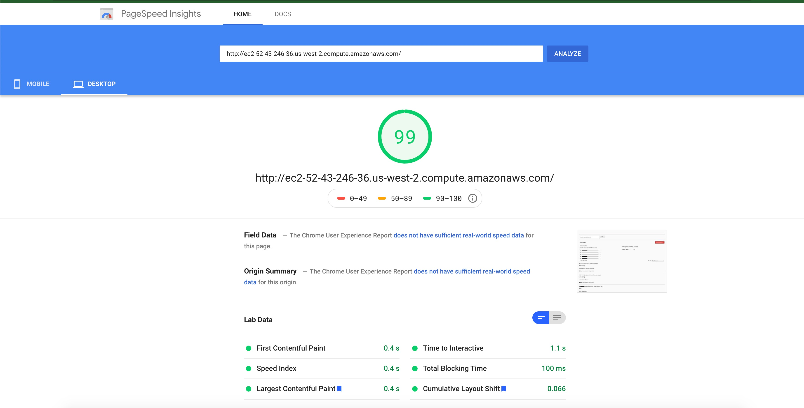
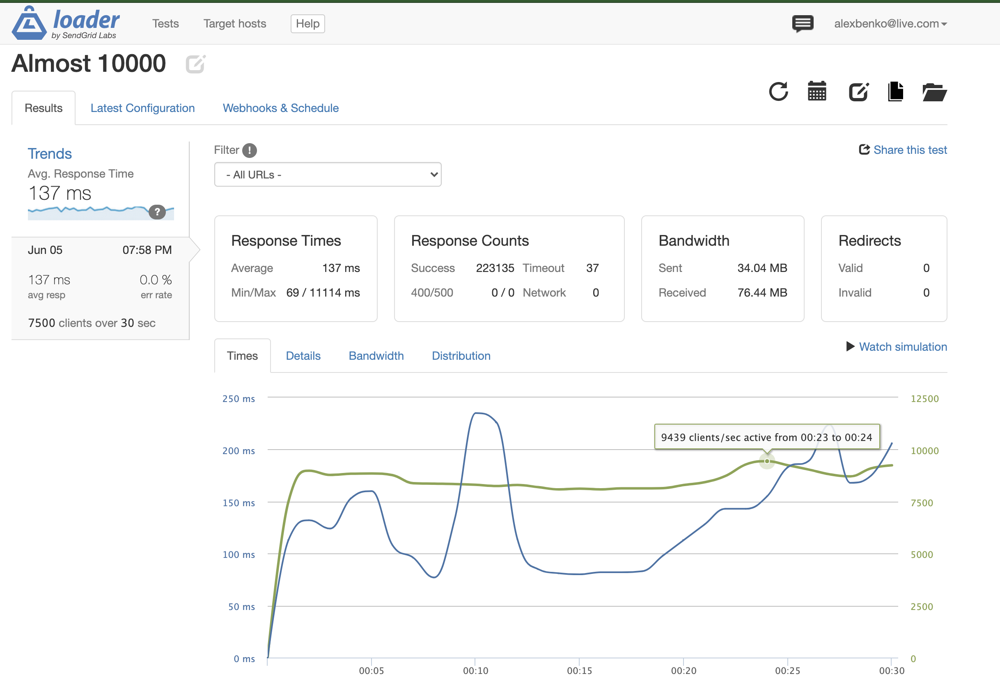

# reviews-SDC

My Trello Board For this Application:  
  https://trello.com/b/YyDNqINY/review-sdc  

My Journal For this:
  https://docs.google.com/document/d/1Kd_1wOL9ta_JExj_6RepGAGFlwKFvAzxEGeZm9H_24E/edit?usp=sharing  

Link For Deployed Version
  http://ec2-52-43-246-36.us-west-2.compute.amazonaws.com/  

  Total Servers: 
    1 Nginx  
    3 proxies  

Final Google Speed Test:  
  

 
 
 

Final Stress Test:  
  Low: 8100 RPS  
  High: 9400 RPS  
  Average Latency 137 ms  
  
